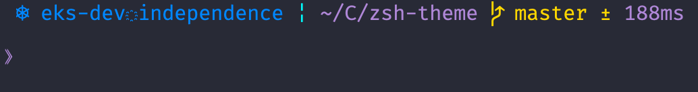

Smiley

A fork of the [eriner](https://github.com/zimfw/eriner) theme.

I just wanted to make the theme more simpler and also add the feature for measuring the elapsed time between commands
and the k8s context in case I've my `KUBECONFIG` var set.

### home

### basic git

### error

### background jobs

### virtualenv

### k8s context-namespace

### virtualenv + k8s

## Configuration

| Variable                  | Description                                                                                           | Default value |
|---------------------------|-------------------------------------------------------------------------------------------------------|---------------|
| `STATUS_COLOR`            | Status segment color                                                                                  | 140           |
| `PWD_COLOR`               | Working directory segment color                                                                       | 140           |
| `CLEAN_COLOR`             | Clean `git` working tree segment color                                                                | 191           |
| `DIRTY_COLOR`             | Dirty `git` working tree segment color                                                                | 220           |
| `SEP`                     | Separator for the status segments                                                                     | \u00A6        |
| `FULL_PATH_VIRTUAL_ENV`   | I usually don't care about the full path or name of the virtualenv, if you want the name put a 1 here | 0             |
| `KUBERNETES_COLOR_PROMPT` | Kubernetes context-namespace color. I'm using `kubens` & `kubectx`                                    | 033           |

There's a function called `print_available_colors` if you want to check the available colors
